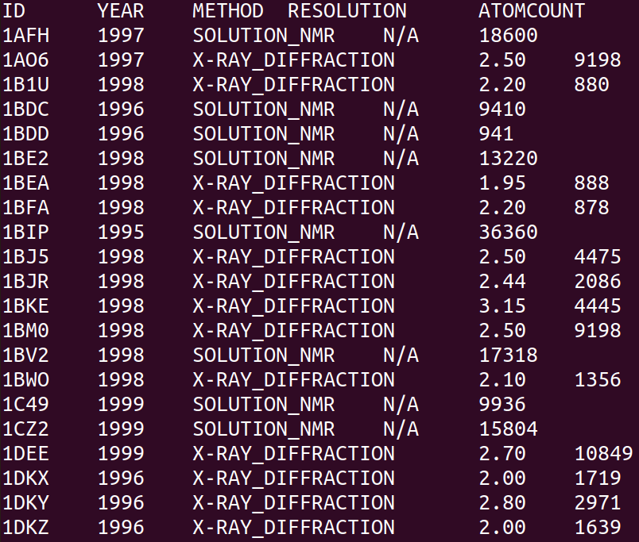

<p align="center">
  
</p>

<h1 align="center">PDB Archive Filter</h1>

## Table of Contents
- [Features](#featrues)
- [Usage](#usage)
- [Options](#options)
- [Installation](#installation)
- [Testing](#testing)
- [Examples](#examples)

---

## Features
This script allows to process different type of file inputs:
- Single or an array of CIF files;
- Single or an array of PDB files;
- Directory absolute path containing either PDB or CIF files;

The output of this script is:
- PDB file identification - ID;
- Year of the publication - YEAR;
- Experimental method - METHOD;
- Resolution of the method used (if applicable) - RESOLUTION;
- Number of atoms - ATOMCOUNT;

CIF and PDB files can be in plain format or in gzipped form with the .gz extension. Also this script returns values in a TAB delimited format:

ID | YEAR | METHOD | RESOLUTION | ATOMCOUNT


---

## Usage
Usage itself is simple. There are 4 possible ways to process a file:
- For single of batch PDB files:
```bash
    ./pdb_archive_filter -pdb filename
```
- For single or batch CIF files:
```bash
    ./pdb_archive_filter -cif filename
```
- For directory containing CIF files:
```
    ./pdb_archive_filter -d -cif directory
```
- For directory containing PDB files:
```bash
    ./pdb_archive_filter -d -pdb directory
```

---

## Options
As it was seen above, this script allows the usage of 3 options. It is important to clarify what type of input is going to be used. This can be achieved by specifying
certain options as arguments before running the program.
- PDB option is used to specify that input file or files are in PDB format;
- CIF option is used to specify that input file or files are in CIF format;
- DIRECTORY option is used to specify that input is going to be a directory name or path to that directory. Has to be used together with -pdb or -cif options. The path has to be an absolute path.
- The script can also take a single option **dash** "-". This allows the input from the keyboard;

## Installation
There is no installation needed. Just download the package and the **pdb_archive_filter** script is ready to use.

---

## Testing
For testing go to the **PDB-Archive-Filter** directory and run the following commands:
- To delete all existing test outputs:
```bash
    make clean-tests
```
- To run tests after deleting the test outputs:
```bash
    make test
```

---

## Examples

Example of the output format in Linux terminal. This is the command that was run:
```bash
    ./pdb_archive_filter -d -pdb ~/Downloads/pdb
```

